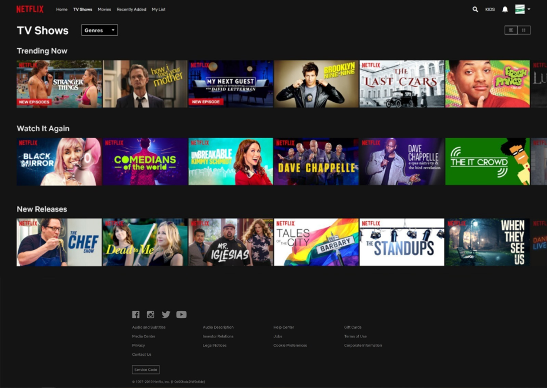
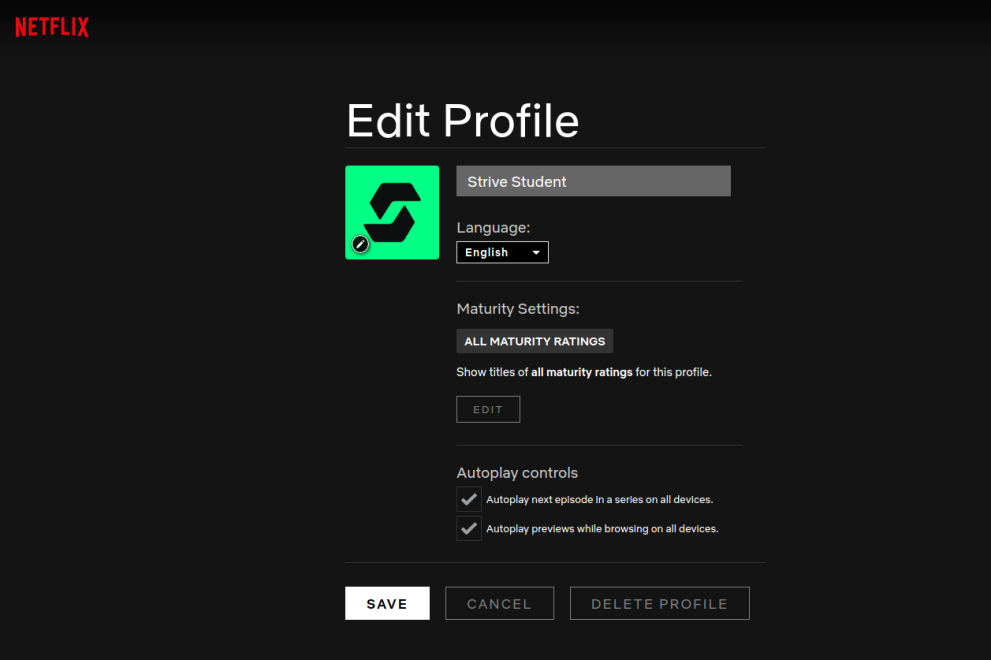
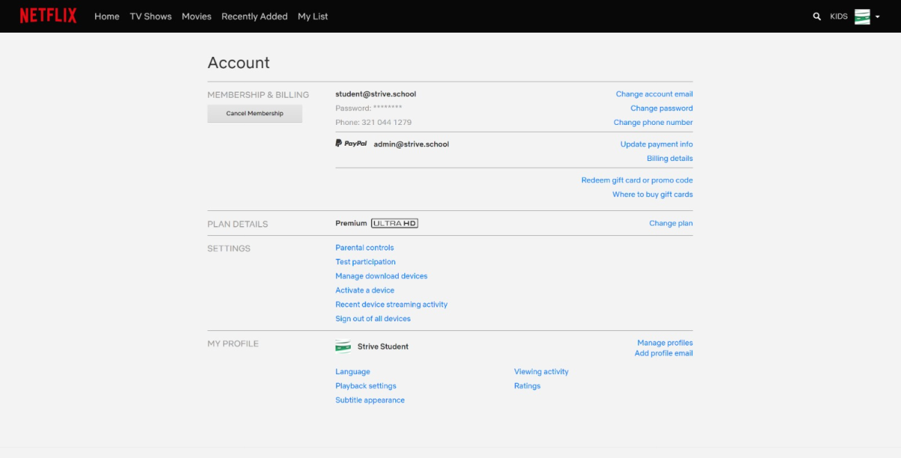

<h1 align="center">
  <br>
  Netflex Clone
  <br>
</h1>

<p align="center">
  <a href="#">
    
  </a>
</p>

<p align="center">
  • <a href="#how-to-use">How To Use</a> •
  <a href="#built-with">Built With</a> •
  <a href="#description">Description</a> •
  <a href="#file-stucture">File Stucture</a> •
   <a href="#author">Authors</a> •

</p>

## Description

> Netflex colone created by broup of the people




## Tools

- npm
- Bootstrap
- Css
- Visual Studio Code
- Git

## How To Use

To clone and run this application,

## File Stucture

```bash
# All the code is insight /src folder
Main Entry Point to the application is

$ cd ./index.html

#All React Component allocated in

$ cd ./profile.html

#Layout of the Application is on

$ cd ./setting.html

```

## Author

👤 **Bekhzod Akhrorov**

- Github:[@Bekhzod96](https://github.com/Bekhzod96)
- Twitter: [@Begzod](https://twitter.com/25d47e8987f740b)
- Linkedin:[@Bekhzod AKhrorov](https://www.linkedin.com/in/bekhzod-akhrorov/)

👤 \*\*\*\*

- Github:
- Twitter:
- Linkedin:

👤 \*\*\*\*

- Github:
- Twitter:
- Linkedin:
